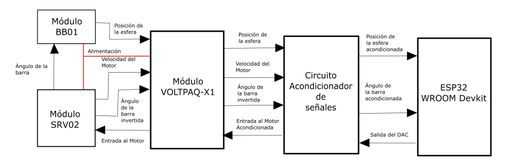
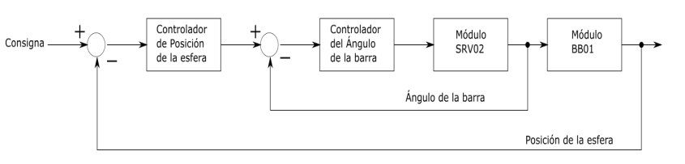
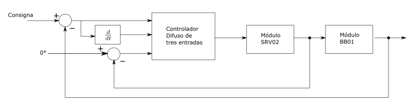
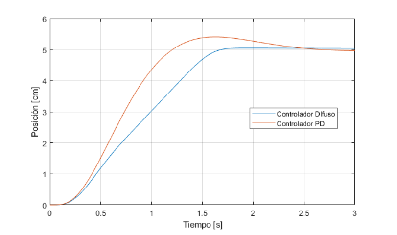
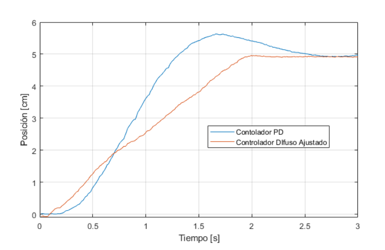

# Control-Difuso-para-Sistema-Ball-and-Beam

## Esquema del sistema de control

## Topologias de control

### Doble lazo

### Controlador Difuso con tres entradas

## Resultado simulación

## Resultado implementación.

